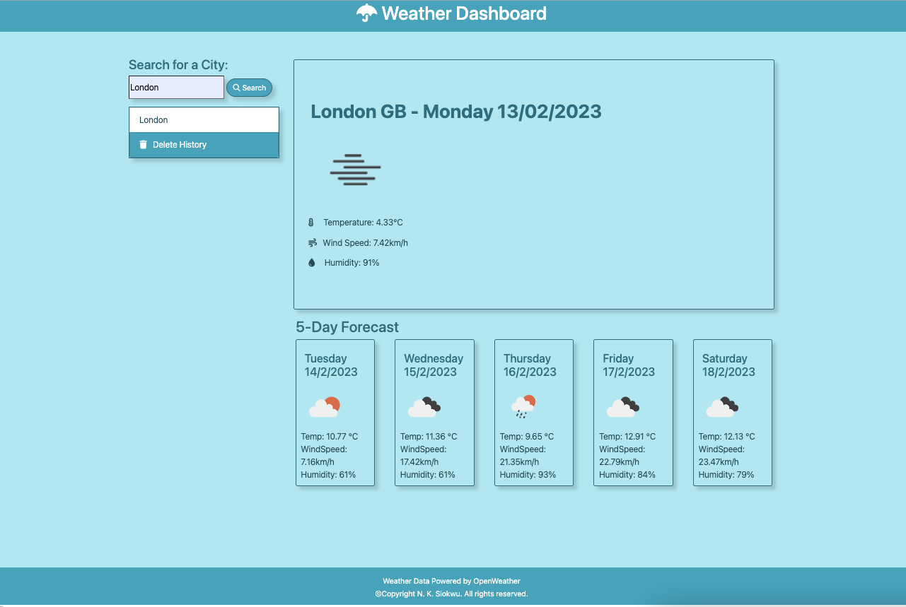
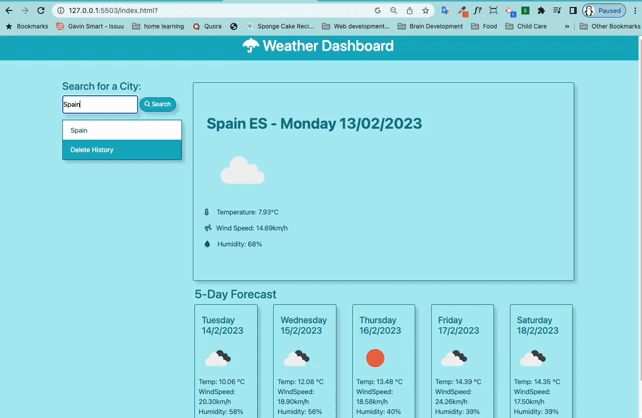

# Weather Dashboard

## Description
This web application is a dynamic weather dashboard that provides the current weather conditions and a 5 day forecast for a city entered by the user. It uses the OpenWeatherMap API to request and display the city, country initials, temperature, wind speed and humidity to the user. The application stores the users search history in local storage and displays it on the UI for easy access. The user has the option to delete the search history with one click. The application is designed to be sleek and responsive.

## Technologies Used
* HTML
* CSS
* JavaScript
* jQuery
* Bootstrap 4.3.1
* OpenWeather API
* Moment.js

## Demo

## Screenshot

## Live Application

## Credit
* Normalize.CSS : https://byby.dev/normalize-css
* Reset.CSS: https://www.joshwcomeau.com/css/custom-css-reset/normalize-css-or-css-reset-9d75175c5d1e
* https://www.youtube.com/watch?v=4UoUqnjUC2c
* https://www.youtube.com/watch?v=QEu8_5bYm-w
* https://www.webdevsplanet.com/post/bootstrap-col-xs-*-not-working?utm_content=cmp-true
* https://stackoverflow.com/questions/643879/css-to-make-html-page-footer-stay-at-bottom-of-the-page-with-a-minimum-height-b
